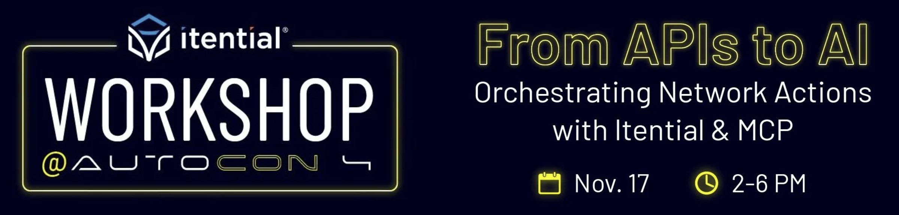

## ⚡️ From APIs to AI: Orchestrating Network Actions with Itential & MCP
**Proctors**: _Peter Sprygada, Mike Elrom, William Collins_  
**Level, Networking**: _Beginner_  
**Level, Systems/Linux**: _Beginner_  
**Level, Programming**: _Beginner_  
**Description**: _In this hands-on workshop, you'll explore how the Itential Platform and Itential's MCP Server work together to power real-world network automation workflows - whether triggered by APIs, self-service portals, AI Agents, or Assistants like Claude. This workshop is perfect for beginners - no prior knowledge of Itential required._  
**Agenda**:  
- Create automation services from Git with the Itential Automation Gateway (IAG)  
- Connect IAG to the Itential Platform to orchestrate those automations  
- Integrate external systems like ServiceNow and NetBox to enrich your workflows  
- Use JSON Forms to capture structured input from users  
- Publish workflows to the Itential Self-Service Portal for role-based execution  
- Trigger orchestrated workflows via APIs or AI assistants like ChatGPT  

## 💡 FAQ
Frequently Asked Questions!

### What did I sign up for? What did I get myself into?
Hopefully you're gonna learn how to use Itential's products to execute network automations (scripts, ansible things and stuff), integrate APIs from systems like NetBox and ServiceNow (via our cool integration framework), and build orchestrated workflows to deliver services that make a real impact on how you operate and deliver your network infrastructure. The plan is to show you how to take your automation efforts from your laptop to the rest of the organization.

### What do I need to do in advance?
Read the FAQ (duh!, who wouldn't?).

You'll receive steps on how to access your hosted environment the week prior, so keep an eye out for that email from our team. That's it — no installations, no setup headaches. We're hosting everything for you!

### How do I access this thing?
You'll receive an email the week prior with your login credentials for your hosted Itential Platform environment. (The email will come from noreply@itential.com, if you don't see it make sure to check your spam folder.)

That's it! Everything is hosted and ready to go — the Itential Platform, IAG (Itential Automation Gateway, because who doesn't love acronyms), and all the workshop assets. Just bring a laptop with a browser and you're golden.

Don't worry we'll be harrassing you about getting signed up.

### What is this Platform and this IAG thing?
The Itential Platform is the engine that allows you to build orchestrated workflows comprised of your scripts, API integrations and reusable assets, execute configuration management tasks like compliance, backups, etc. and build network products for your organization. Cool huh?!

IAG is the automation gateway used to execute python scripts, ansible playbooks and opentofu plans DIRECTLY FROM YOUR REPO!!! Sorry, got excited for a second.

### Wait, do I really need to install IAG?
Nope! We're hosting everything for you. Zero installations required for the workshop itself.

**BUT** — if you want to keep playing after the workshop (and we hope you do!), we've included an [optional IAG setup guide](./iag/README.md) so you can run automations from your own laptop. Your hosted environment will stay live for 14 days after the workshop, giving you plenty of time to experiment and set up your own IAG instance if you're feeling adventurous.

### What are the requirements for the workshop?
Not much! Since everything is hosted, your requirements are super simple:

* **A laptop** — Mac, Windows, Linux, doesn't matter. If it runs a web browser, you're good to go.
* **Internet access** — Hotel or event wifi should be totally fine.
* **A browser** — Chrome, Firefox, Safari, Edge... pick your poison.

> 👏 That's literally it. No installations, no admin rights needed, no fighting with corporate firewalls. We've made this as painless as possible.

### Will I keep access after the workshop?
Yes! Your hosted Itential Platform environment will stay live for **14 days** after the workshop. That gives you two full weeks to keep experimenting, build more workflows, and really get comfortable with the platform.

After that, if you've [set up your own IAG instance](./iag/README.md) (totally optional!), you can keep running automations locally. And of course, additional trials can be requested from our [Itential Website](https://www.itential.com/get-started/) whenever you need them.

## 📒 Repository Structure

This repository contains everything you need for the workshop:

* **`assets/`** - All workshop assets including:
  * `api-specs/` - API specifications for NetBox and ServiceNow
  * `import.yaml` - IAG configuration for services, decorators, and repositories
  * `playbooks/` - Ansible playbooks for network automation
  * `scripts/` - Python scripts for network operations
* **`iag/`** - IAG installation guide and documentation

## 🔧 Getting Started

1. Read this FAQ (you're already doing great!)
2. Wait for your platform access email (check that spam folder!)
3. Show up with your laptop and a browser
4. Get ready to automate!

**Post-Workshop (Optional):**
- Check out the [IAG installation guide](./iag/README.md) if you want to run automations from your own machine
- Explore this repository's assets to see all the scripts and playbooks we'll be using

## 🚨 Need Help?

Having issues? Questions? Concerns about life, the universe, and everything?

Contact us at workshop@itential.com
